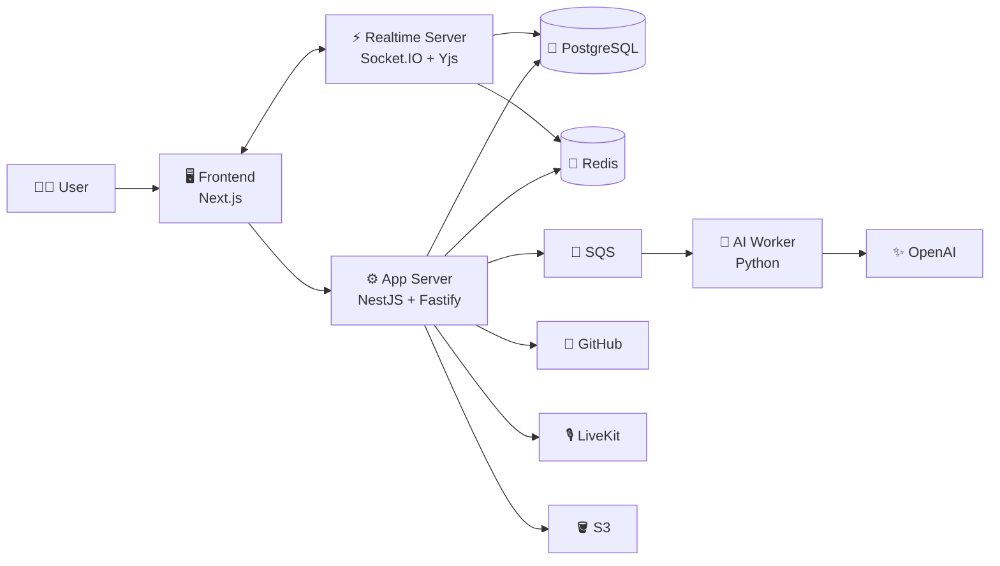

<div align="center">

# 🚀 PILO

### 개발팀의 모든 흐름을 하나의 Workspace로

**GitHub 프로젝트 운영부터 PR 리뷰, 회의, 문서, 캔버스, 일정, ERD, AI Agent까지**<br />
흩어진 개발 협업 도구를 한곳에서 연결하는 올인원 워크스페이스입니다.

<br />


<br />

`크래프톤 정글 나만무 · 301-2팀`

</div>

---

## 👀 PILO는 무엇인가요?

개발팀은 이슈를 확인하고, 코드를 리뷰하고, 회의하고, 결정 사항을 기록하기 위해
여러 도구를 계속 오갑니다. PILO는 이 흐름을 **Workspace 단위로 연결**해 팀의
맥락이 흩어지지 않도록 돕습니다.

> 💡 **한곳에서 보고, 함께 판단하고, 바로 실행하세요.**

## ✨ 주요 기능

| | 기능 | 설명 |
| :---: | --- | --- |
| 🏠 | **Workspace** | 팀, 권한, 알림, 현재 활동을 하나의 공간에서 관리합니다. |
| 🐙 | **GitHub 연동** | Repository, Issue, Pull Request, Projects v2 데이터를 동기화합니다. |
| 📋 | **Kanban Board** | GitHub Project 기반 업무를 보드에서 조회하고 상태를 관리합니다. |
| 🔍 | **AI PR Review** | PR의 변경 흐름과 파일별 diff를 분석하고 리뷰 결정을 공유합니다. |
| 🎙️ | **Meeting** | LiveKit 기반 음성 회의, 녹음, STT, AI 회의록 생성을 지원합니다. |
| 🎨 | **Canvas** | 도형, 메모, 코드 블록을 자유롭게 배치하고 협업 맥락을 시각화합니다. |
| 🗓️ | **Calendar** | Workspace 일정과 Google Calendar 동기화를 관리합니다. |
| 🧩 | **SQL to ERD** | PostgreSQL/MySQL DDL을 분석해 테이블과 관계를 시각화합니다. |
| 📁 | **Drive & Docs** | 팀 파일을 관리하고 문서를 실시간으로 공동 편집합니다. |
| 💬 | **Chat & Presence** | 팀 채팅, 멘션, 읽지 않은 메시지, 접속 상태를 실시간으로 전달합니다. |
| 🤖 | **PILO Agent** | 자연어 요청을 이해하고 여러 Workspace 도구를 안전하게 실행합니다. |

## 🏗️ 아키텍처



### 🧱 서비스 구성

| 서비스 | 역할 | 기본 로컬 주소 |
| --- | --- | --- |
| `frontend` | 사용자 화면과 클라이언트 상태 | `http://localhost:3000` |
| `app-server` | REST API, 인증, 도메인 로직 | `http://localhost:4000/api/v1` |
| `realtime-server` | Socket.IO 이벤트와 Yjs 문서 동기화 | `http://localhost:4001` |
| `ai-worker` | SQS 기반 AI·STT·회의록 작업 처리 | 외부 포트 없음 |

### 🛠️ 기술 스택

| 영역 | 기술 |
| --- | --- |
| 🎨 Frontend | Next.js 16, React 19, TypeScript, Tailwind CSS 4, tldraw, TipTap |
| ⚙️ Backend | NestJS 11, Fastify 5, Node.js 22 |
| ⚡ Realtime | Socket.IO, WebSocket, Hocuspocus, Yjs, Redis |
| 🧠 AI Worker | Python 3.12, LangGraph, OpenAI API, FastAPI |
| 💾 Data | PostgreSQL 16, Redis 7, S3 |
| 📨 Async | Amazon SQS, LocalStack |
| ☁️ Infra | Docker, AWS ECS, Terraform, GitHub Actions |
| 🎙️ Media | LiveKit, LiveKit Egress |

## 🚀 빠른 시작

### 1️⃣ 준비물

- [Node.js 22](https://nodejs.org/)
- [Python 3.12](https://www.python.org/)
- [Docker](https://www.docker.com/) + Docker Compose
- npm

### 2️⃣ 환경 변수와 로컬 인프라

```bash
git clone <repository-url>
cd PILO

cp .env.example .env
docker compose -f docker-compose.dev.yml up -d
```

Compose가 다음 개발 인프라를 실행합니다.

| 인프라 | 포트 | 용도 |
| --- | :---: | --- |
| 🐘 PostgreSQL | `5432` | 애플리케이션 데이터 |
| 🔴 Redis | `6379` | 캐시와 실시간 이벤트 |
| ☁️ LocalStack | `4566` | 로컬 SQS |

> ⚠️ DB 마이그레이션은 **새 PostgreSQL 볼륨이 처음 생성될 때** 자동 적용됩니다.
> LiveKit은 이 Compose 파일에 포함되어 있지 않으므로 회의·녹음 기능을 확인하려면
> 별도의 LiveKit 환경이 필요합니다.

### 3️⃣ 의존성 설치

```bash
npm ci --prefix apps/frontend
npm ci --prefix apps/app-server
npm ci --prefix apps/realtime-server

python3.12 -m venv apps/ai-worker/.venv
source apps/ai-worker/.venv/bin/activate
pip install -r apps/ai-worker/requirements.txt \
  -r apps/ai-worker/requirements-dev.txt
```

### 4️⃣ 애플리케이션 실행

먼저 각 터미널에서 루트 환경 변수를 불러옵니다.

```bash
set -a
source .env
set +a
```

그다음 서비스별로 아래 명령을 실행합니다.

```bash
# 🖥️ Terminal 1 — Frontend
npm --prefix apps/frontend run dev

# ⚙️ Terminal 2 — App Server
PORT=4000 npm --prefix apps/app-server run build
PORT=4000 npm --prefix apps/app-server start

# ⚡ Terminal 3 — Realtime Server
PORT=4001 npm --prefix apps/realtime-server run build
PORT=4001 npm --prefix apps/realtime-server start

# 🧠 Terminal 4 — AI Worker (선택 · OPENAI_API_KEY 필요)
source apps/ai-worker/.venv/bin/activate
PYTHONPATH=apps/ai-worker python -m app.worker
```

이제 브라우저에서 **[http://localhost:3000](http://localhost:3000)** 으로 접속하세요. 🎉

> 🔐 기본 `.env.example`은 로컬 UI 확인을 위한 mock 인증 모드를 사용합니다.
> GitHub, Google Calendar, OpenAI, S3, LiveKit 기능은 해당 서비스의 실제 키와
> 환경 설정이 있어야 완전하게 동작합니다. 비밀 값은 절대 Git에 커밋하지 마세요.
> `OPENAI_API_KEY`가 비어 있으면 AI Worker는 시작되지 않지만, 나머지 세
> 애플리케이션 서비스는 별도로 실행할 수 있습니다.

## ✅ 테스트와 품질 검사

| 대상 | 테스트 | 타입·린트 | 포맷 |
| --- | --- | --- | --- |
| 🖥️ Frontend | `npm --prefix apps/frontend test` | `npm --prefix apps/frontend run lint` | `npm --prefix apps/frontend run format:check` |
| ⚙️ App Server | `npm --prefix apps/app-server test` | `npm --prefix apps/app-server run lint` | `npm --prefix apps/app-server run format:check` |
| ⚡ Realtime | `npm --prefix apps/realtime-server test` | `npm --prefix apps/realtime-server run lint` | `npm --prefix apps/realtime-server run format:check` |
| 🧠 AI Worker | `cd apps/ai-worker && pytest` | `cd apps/ai-worker && ruff check app tests scripts` | `cd apps/ai-worker && black --check app tests scripts` |

## 📂 프로젝트 구조

```text
PILO/
├── apps/
│   ├── frontend/          # 🖥️ Next.js 웹 애플리케이션
│   ├── app-server/        # ⚙️ NestJS REST API
│   ├── realtime-server/   # ⚡ 실시간 이벤트·문서 동기화
│   └── ai-worker/         # 🧠 비동기 AI 작업 처리
├── db/
│   ├── migrations/        # 🐘 순차 DB 마이그레이션
│   └── operations/        # 🧰 운영용 SQL
├── docs/
│   └── api/               # 📚 도메인별 API 계약
├── infra/                 # ☁️ Terraform·배포 인프라
├── localstack/            # 📨 로컬 AWS 리소스 초기화
├── docker-compose.dev.yml
└── README.md
```

## 📚 문서 안내

- 📌 [통합 기능 명세](./Project_Planning_Document.md)
- 🔌 [API 계약 인덱스](./docs/api/README.md)
- 🗃️ [데이터베이스 가이드](./db/README.md)
- 🤖 [Agent Tool 개발 가이드](./docs/AgentToolGuide.md)
- 👥 [도메인 소유권과 협업 규칙](./AGENTS.md)
- 🌿 [Issue·Commit·PR 컨벤션](./convention.md)
- 🧑‍💻 [코딩 규칙](./coding-rule.md)

## 🤝 기여하기

PILO는 도메인 계약과 데이터 일관성을 중요하게 다룹니다.

1. 📖 작업 전에 `AGENTS.md`와 해당 도메인의 `docs/api/*.md`를 확인합니다.
2. 🌱 작업 브랜치를 만들고 변경 범위를 작게 유지합니다.
3. ✅ 테스트, 타입 검사, 포맷 검사를 통과시킵니다.
4. 📝 `convention.md`에 맞춰 Issue, Commit, PR을 작성합니다.
5. 🚨 API·DB·공통 영역 변경은 담당자의 리뷰를 받습니다.

---

<div align="center">

### 🌱 팀의 아이디어가 제품이 되는 모든 순간, **PILO**

Made with ☕, 🔥 and teamwork by **301-2팀**

</div>
