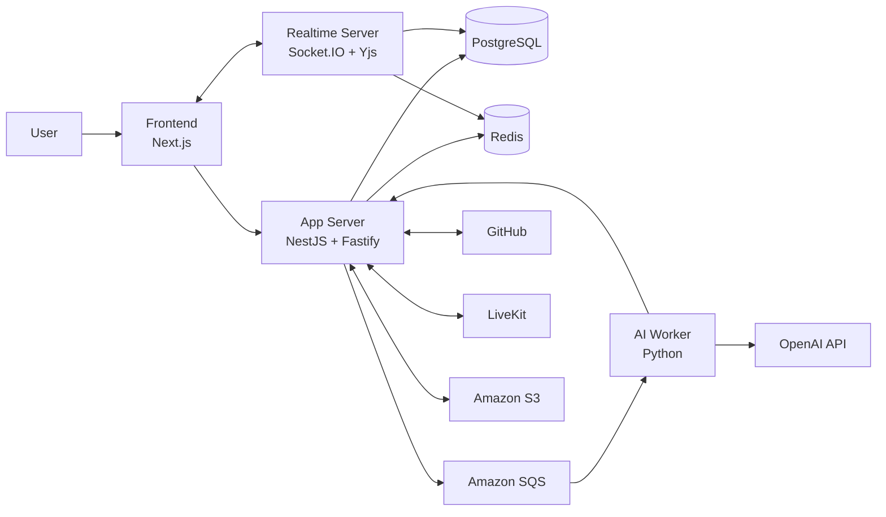

<div align="center">

# PILO


### 개발팀의 모든 흐름을 하나의 Workspace로

GitHub 프로젝트 운영, PR 리뷰, 회의, 문서, 캔버스, 일정, ERD와 AI Agent를<br />
하나의 작업 맥락으로 연결하는 개발 협업 플랫폼입니다.

<br />


<br />

`크래프톤 정글 나만의 무기 만들기 · 301-2팀`

</div>

---

## 1. 왜 이 프로젝트를 만들었는가

개발팀의 실제 업무는 하나의 도구 안에서 끝나지 않습니다.

- GitHub에서 Issue와 Pull Request를 확인합니다.
- 별도의 회의 도구에서 논의하고 결정합니다.
- 문서, 메신저, 캘린더와 화이트보드에 후속 맥락을 나누어 기록합니다.
- 다시 작업을 시작할 때 여러 도구를 오가며 결정의 근거를 복원합니다.

도구가 분리될수록 정보 자체보다 **정보 사이의 연결**이 먼저 사라집니다. PR의 변경 이유,
회의에서 내린 결정, 담당자와 일정이 서로 다른 곳에 남기 때문입니다.

PILO는 이 문제를 해결하기 위해 모든 기능을 **Workspace** 안에 배치했습니다. 단순히 여러
기능을 한 화면에 모으는 것이 아니라, GitHub 작업·실시간 협업·팀 기록·AI 실행이 같은
사용자와 Workspace 문맥을 공유하도록 설계했습니다.

---

## 2. 프로젝트 목표

PILO를 만들며 답하고자 한 질문은 세 가지였습니다.

1. GitHub를 원본으로 유지하면서 프로젝트 운영과 코드 리뷰를 한곳에서 수행할 수 있을까?
2. 여러 사용자가 동시에 작업해도 저장 데이터와 실시간 상태를 일관되게 관리할 수 있을까?
3. AI가 팀의 실제 도구를 사용하되, 권한과 사용자 확인을 우회하지 않게 만들 수 있을까?

이를 위해 다음 원칙을 세웠습니다.

- 모든 데이터 접근은 현재 사용자와 Workspace 권한을 기준으로 제한합니다.
- GitHub 원본 데이터와 PILO 내부 협업 데이터를 구분합니다.
- 영속 데이터는 App Server와 PostgreSQL이, 실시간 전달은 Realtime Server가 담당합니다.
- AI Agent는 기존 도메인 서비스를 재사용하고, 쓰기 작업은 실행 전에 사용자 확인을 받습니다.

---

## 3. 프로젝트의 큰 구조

PILO는 역할이 다른 네 개의 애플리케이션으로 구성됩니다.

| 애플리케이션 | 역할 | 기본 로컬 주소 |
| --- | --- | --- |
| `frontend` | 사용자 화면, 서버 상태 조회, 실시간 협업 UI | `http://localhost:3000` |
| `app-server` | REST API, 인증·권한, 도메인 로직, 영속 데이터 관리 | `http://localhost:4000/api/v1` |
| `realtime-server` | Socket.IO 이벤트, Presence, Yjs 문서 동기화 | `http://localhost:4001` |
| `ai-worker` | SQS 기반 AI 계획, STT, 회의록 등 비동기 작업 | 외부 포트 없음 |

즉,

- `frontend`는 사용자가 보고 조작하는 작업 공간을 만들고,
- `app-server`는 데이터와 권한의 기준을 지키며,
- `realtime-server`는 여러 사용자의 현재 상태를 빠르게 전달하고,
- `ai-worker`는 시간이 오래 걸리는 AI 작업을 비동기로 처리합니다.

---

## 4. 핵심 기능을 어떻게 연결했는가

### 4-1. GitHub Integration과 Kanban Board

Workspace에 GitHub App과 사용자 OAuth를 연결하면 Repository, Issue, Pull Request,
Projects v2 데이터를 동기화할 수 있습니다. Kanban Board는 이 데이터를 기반으로 업무 상태를
조회하고, 허용된 범위에서 Issue 생성·수정과 상태·담당자 변경을 수행합니다.

GitHub 데이터의 소유권을 PILO로 옮기는 구조는 아닙니다. GitHub를 외부 원본으로 유지하고,
PILO는 동기화 상태와 Workspace별 작업 화면을 관리합니다.

### 4-2. AI PR Review

리뷰어는 동기화된 open PR을 선택해 리뷰 세션을 시작합니다. PILO는 변경 파일과 diff,
AI 분석 결과를 리뷰 캔버스에 구성하고, 참여자는 파일별 판단과 메모를 함께 정리합니다.
완료된 결과는 현재 사용자의 GitHub OAuth 권한으로 GitHub Review에 제출합니다.

PR Review의 목적은 AI가 리뷰를 대신 확정하는 것이 아닙니다. AI는 변경 구조를 파악하는 데
도움을 주고, 최종 판단과 외부 제출은 사용자가 담당합니다.

### 4-3. Meeting과 팀 기록

Meeting은 LiveKit 기반 음성 회의와 화면 공유, 녹음 상태를 관리합니다. 녹음이 끝나면
AI Worker가 STT와 LLM 작업을 처리해 회의록과 후속 Action Item을 생성합니다.

팀의 나머지 맥락은 다음 기능으로 이어집니다.

- `Drive`: Workspace 파일·폴더와 공동 편집 문서를 관리합니다.
- `Chat`: 일반 채팅, 멘션, 읽지 않은 메시지를 관리합니다.
- `Calendar`: Workspace 내부 일정을 생성·조회·수정·삭제합니다.

### 4-4. Canvas와 SQL to ERD

Canvas에서는 도형, 메모, 코드 블록과 파일 참조를 자유롭게 배치할 수 있습니다. 저장되는
도형과 operation은 App Server가 관리하고, Realtime Server는 커서·선택·편집 preview와
operation 전달을 담당합니다.

SQL to ERD는 PostgreSQL/MySQL DDL을 분석해 테이블 카드와 FK 관계선을 만들고, 결과를
Workspace별 세션으로 저장합니다. 자유형 Canvas와 같은 렌더링 기반을 활용하지만 데이터와
저장 계약은 독립적으로 유지합니다.

### 4-5. PILO Agent

사용자는 자연어로 Workspace의 일정, 보드, 회의, 회의록, PR Review, SQL ERD 등을 조회하거나
지원되는 작업을 요청할 수 있습니다.

Agent는 별도의 우회 API로 데이터베이스를 직접 변경하지 않습니다. App Server에 등록된 기존
도메인 서비스를 도구로 사용하고, 입력과 Workspace 권한을 다시 검증합니다. 조회는 자동으로
실행할 수 있지만 생성·수정 같은 쓰기 작업은 confirmation을 만든 뒤 사용자가 승인한 계획만
실행합니다. 삭제나 승인되지 않은 외부 변경과 같은 고위험 작업은 자동 실행하지 않습니다.

---

## 5. 사용자의 작업 흐름

PILO에서 하나의 작업은 다음과 같이 이어집니다.

1. 사용자가 로그인하고 Workspace를 생성하거나 초대를 통해 참여합니다.
2. Workspace에 GitHub App과 필요한 사용자 OAuth를 연결합니다.
3. Repository, Issue, Pull Request, Projects v2 데이터를 동기화합니다.
4. Kanban Board에서 업무 상태와 담당자를 확인합니다.
5. open PR을 리뷰 세션으로 가져와 diff와 AI 분석을 함께 검토합니다.
6. 팀은 회의를 진행하고, 녹음에서 회의록과 Action Item을 생성합니다.
7. 결정과 자료를 Canvas, Drive, Chat, Calendar 또는 SQL ERD 세션에 남깁니다.
8. 필요하면 PILO Agent가 같은 Workspace 문맥에서 정보를 찾거나 승인된 후속 작업을 수행합니다.

핵심은 각 기능을 따로 사용하는 것이 아니라, **같은 사용자·Workspace·권한 경계 안에서
업무의 흐름을 계속 이어가는 것**입니다.

---

## 6. 상태와 작업은 어떻게 흐르는가



일반적인 데이터 변경은 `Frontend -> App Server -> PostgreSQL` 순서로 처리됩니다.
실시간 이벤트는 Realtime Server가 전달하지만, Realtime Server 자체를 영속 데이터의 원본으로
사용하지 않습니다. AI·STT처럼 오래 걸리는 작업은 SQS로 분리하고, Worker의 처리 결과를 다시
App Server의 도메인 경계로 전달합니다.

이 구조를 통해 다음 책임을 분리했습니다.

- REST 요청 실패와 실시간 연결 실패를 서로 다른 문제로 다룰 수 있습니다.
- 재접속 후에는 실시간 메모리가 아니라 서버의 저장 상태를 기준으로 복구할 수 있습니다.
- AI 작업이 느리거나 실패해도 일반 API와 실시간 협업을 독립적으로 운영할 수 있습니다.

---

## 7. 현재 지원 범위와 경계

README의 기능 설명은 목표가 아니라 현재 계약 기준입니다. 특히 다음 범위는 의도적으로
제한되어 있습니다.

| 영역 | 현재 경계 |
| --- | --- |
| Calendar | Workspace 내부 일정 CRUD를 지원하며, 반복 일정·알림·외부 Calendar 동기화는 지원하지 않습니다. |
| GitHub | 공개 Repository write API, PR close, GitHub inline review comment는 지원 범위가 아닙니다. |
| PR Review | 파일별 comment는 GitHub inline comment가 아니라 Review body로 제출합니다. |
| Agent | 조회는 자동 실행할 수 있지만 쓰기는 confirmation이 필요하며, 고위험 도구는 실행하지 않습니다. |
| Local auth | 기본 `.env.example`은 UI 확인용 mock 인증입니다. 실제 GitHub·Workspace 흐름 검증에는 OAuth 설정이 필요합니다. |
| Media·Storage | LiveKit과 실제 S3는 로컬 Compose에 포함되지 않으며 별도 환경이 필요합니다. |

---

## 8. 기술 스택

| 영역 | 기술 |
| --- | --- |
| Frontend | Next.js 16, React 19, TypeScript, Tailwind CSS 4, TanStack Query, tldraw, TipTap |
| App Server | NestJS 11, Fastify 5, Node.js 22 |
| Realtime | Socket.IO, Hocuspocus, Yjs, Redis |
| AI Worker | Python 3.12, LangGraph, OpenAI API |
| Data | PostgreSQL 16, Redis 7, Amazon S3 |
| Async | Amazon SQS, LocalStack |
| Media | LiveKit, LiveKit Egress |
| Infra | Docker, AWS ECS, Terraform, GitHub Actions |

---

## 9. 로컬에서 실행하기

### 9-1. 준비물

- [Node.js 22](https://nodejs.org/)
- [Python 3.12](https://www.python.org/)
- [Docker](https://www.docker.com/)와 Docker Compose
- npm

### 9-2. 저장소와 환경 변수 준비

```bash
git clone https://github.com/Developer-EJ/PILO.git
cd PILO

cp .env.example .env
docker compose -f docker-compose.dev.yml up -d
```

Compose는 다음 로컬 인프라를 실행합니다.

| 인프라 | 포트 | 용도 |
| --- | :---: | --- |
| PostgreSQL | `5432` | 애플리케이션 데이터 |
| Redis | `6379` | 캐시와 실시간 이벤트 |
| LocalStack | `4566` | 로컬 SQS |

> DB migration은 새 PostgreSQL volume이 처음 생성될 때 자동 적용됩니다. 기존 volume에
> migration을 다시 적용하는 절차는 [`db/README.md`](./db/README.md)를 확인하세요.

### 9-3. 의존성 설치

```bash
npm ci --prefix apps/frontend
npm ci --prefix apps/app-server
npm ci --prefix apps/realtime-server

python3.12 -m venv apps/ai-worker/.venv
source apps/ai-worker/.venv/bin/activate
pip install -r apps/ai-worker/requirements.txt \
  -r apps/ai-worker/requirements-dev.txt
```

### 9-4. 애플리케이션 실행

각 터미널에서 먼저 루트 환경 변수를 불러옵니다.

```bash
set -a
source .env
set +a
```

그다음 서비스별로 실행합니다.

```bash
# Terminal 1 — Frontend
npm --prefix apps/frontend run dev

# Terminal 2 — App Server
PORT=4000 npm --prefix apps/app-server run build
PORT=4000 npm --prefix apps/app-server start

# Terminal 3 — Realtime Server
PORT=4001 npm --prefix apps/realtime-server run build
PORT=4001 npm --prefix apps/realtime-server start

# Terminal 4 — AI Worker (선택, OPENAI_API_KEY 필요)
source apps/ai-worker/.venv/bin/activate
PYTHONPATH=apps/ai-worker python -m app.worker
```

이제 [http://localhost:3000](http://localhost:3000)에서 PILO에 접속할 수 있습니다.

> `.env.example`의 `NEXT_PUBLIC_PILO_AUTH_MODE=mock`은 로컬 UI 확인을 위한 설정입니다.
> GitHub, OpenAI, S3, LiveKit 기능은 각 서비스의 실제 key와 환경을 설정해야 완전하게
> 동작합니다. 비밀 값은 Git에 커밋하지 마세요.

---

## 10. 테스트와 품질 검사

| 대상 | 테스트 | 타입·린트 | 포맷 |
| --- | --- | --- | --- |
| Frontend | `npm --prefix apps/frontend test` | `npm --prefix apps/frontend run lint` | `npm --prefix apps/frontend run format:check` |
| App Server | `npm --prefix apps/app-server test` | `npm --prefix apps/app-server run lint` | `npm --prefix apps/app-server run format:check` |
| Realtime Server | `npm --prefix apps/realtime-server test` | `npm --prefix apps/realtime-server run lint` | `npm --prefix apps/realtime-server run format:check` |
| AI Worker | `cd apps/ai-worker && pytest` | `cd apps/ai-worker && ruff check app tests scripts` | `cd apps/ai-worker && black --check app tests scripts` |

---

## 11. 프로젝트 구조

```text
PILO/
├── apps/
│   ├── frontend/          # Next.js 웹 애플리케이션
│   ├── app-server/        # NestJS REST API와 도메인 로직
│   ├── realtime-server/   # Socket.IO·Yjs 실시간 동기화
│   └── ai-worker/         # 비동기 AI·STT 작업
├── db/
│   ├── migrations/        # 순차 DB migration
│   └── operations/        # 운영용 SQL
├── docs/
│   └── api/               # 도메인별 API 계약
├── infra/                 # Terraform과 배포 인프라
├── localstack/            # 로컬 AWS resource 초기화
├── docker-compose.dev.yml
└── README.md
```

주요 문서는 다음과 같습니다.

- [통합 기능 명세](./Project_Planning_Document.md)
- [API 계약 인덱스](./docs/api/README.md)
- [데이터베이스 가이드](./db/README.md)
- [Agent Tool 개발 가이드](./docs/AgentToolGuide.md)
- [도메인 소유권과 협업 규칙](./AGENTS.md)
- [Issue·Commit·PR 컨벤션](./convention.md)
- [코딩 규칙](./coding-rule.md)

---

## 12. 정리

PILO는 협업 도구의 개수를 늘리는 프로젝트가 아니라, 개발 과정에서 끊기는 맥락을 하나의
Workspace 안에서 다시 연결하는 프로젝트입니다.

이 프로젝트를 통해 저희는 다음 문제를 직접 다루었습니다.

- 외부 서비스와 내부 데이터의 소유권을 어떻게 나눌지
- REST, 실시간 연결, 비동기 작업의 책임을 어떻게 분리할지
- 여러 사용자의 동시 작업을 어떻게 저장하고 복구할지
- AI가 실제 팀 도구를 사용하면서도 권한과 확인 절차를 어떻게 지킬지

<div align="center">

### 팀의 아이디어가 제품이 되는 모든 순간, PILO

Made by **301-2팀**

</div>
