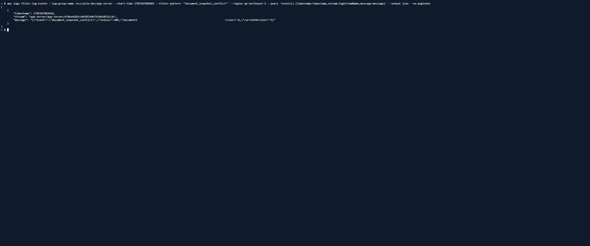
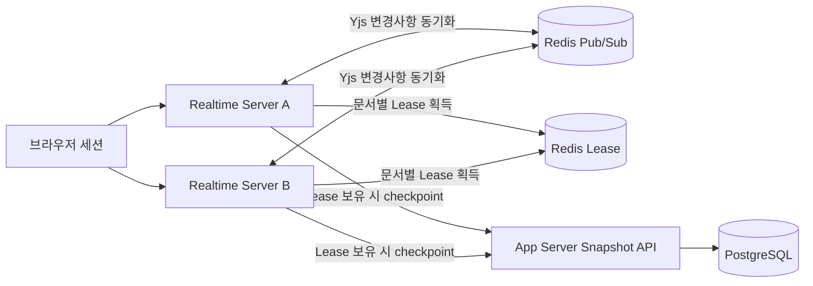
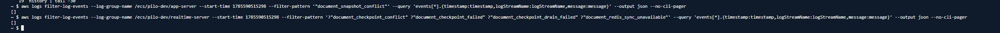
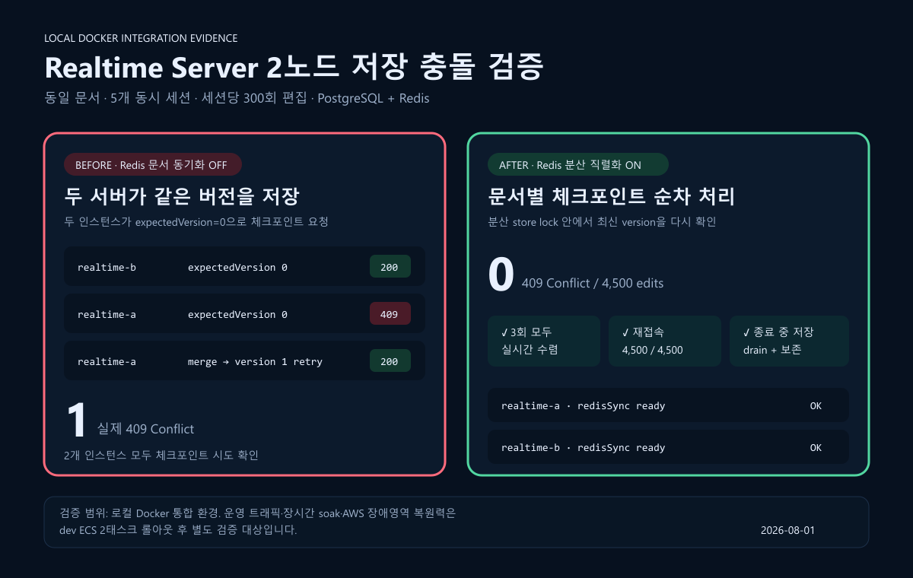

# Realtime Server 수평 확장 시 발생한 문서 저장 충돌 해소

Realtime Server를 여러 대로 운영하면서도 같은 문서의 checkpoint 저장은 한 번에 한 서버만 수행하도록 만들었다. Redis로 서버 간 Yjs 변경사항을 동기화하고, 문서별 분산 Lease로 저장 순서를 직렬화했다. 아래 결과는 **개발 ECS의 Realtime Server 2대**에서 확인한 범위이며, 모든 장애 상황에서의 무손실을 뜻하지는 않는다.

## 문제

동일 문서를 편집하는 사용자가 서로 다른 Realtime Server에 연결되면, 각 인스턴스는 자체 메모리의 저장 큐만 보고 checkpoint를 수행한다. 따라서 두 서버가 같은 문서의 동일 버전을 기준으로 저장을 시작할 수 있었다.

```text
Realtime Server A와 B가 같은 expectedVersion 조회
→ 각 인스턴스가 독립적으로 checkpoint 저장 요청
→ 먼저 처리된 요청이 문서 버전을 증가
→ 나중 요청이 이전 expectedVersion으로 저장되어 409 Conflict
```

개선 전 개발 ECS 2대 검증에서 실제 `409 Conflict`를 확인했다. 문서 식별값은 공개용으로 가렸다.



원인은 저장 큐가 **인스턴스 내부에서만** 순서를 보장했다는 점이다. Realtime Server를 2대로 늘리면 같은 문서의 checkpoint가 두 큐에서 동시에 실행될 수 있어, 서버 간 저장 순서를 보장할 수 없었다.

## 해결



- **서버 간 편집 동기화**: Redis Pub/Sub으로 각 Realtime Server의 Yjs 변경사항을 전달해, 서버가 달라도 같은 문서 상태를 공유하도록 구성했다.
- **문서별 저장 직렬화**: checkpoint를 시작하기 전에 Redis의 문서별 Lease를 획득한다. Lease를 얻은 서버만 저장하고, 다른 서버는 Lease가 해제된 뒤 최신 상태를 기준으로 저장한다. 서로 다른 문서는 병렬로 처리할 수 있다.
- **저장 안정성 보강**: 변경사항은 1초 동안 묶어 checkpoint하고, 예외적으로 `409 Conflict`가 발생하면 최신 snapshot을 병합한 뒤 새 버전으로 한 번 재시도한다. 종료 전에는 대기 중인 checkpoint를 처리하며, Redis 동기화 연결이 비정상이면 health check를 실패시켜 안전하지 않은 다중 서버 상태가 계속 서비스되지 않도록 했다.

### Pub/Sub, Lease, 재시도를 분리한 이유

세 장치는 비슷해 보이지만 해결하는 문제가 다르다.

- Redis Pub/Sub은 **두 서버의 문서 메모리를 맞추는 역할**이다. 이것만으로는 두 서버가 같은 시점에 checkpoint를 시작하는 것을 막지 못한다.
- 문서별 Lease는 **저장 요청의 순서를 정하는 역할**이다. 하지만 Lease만으로는 서로 다른 서버에 연결된 사용자의 편집 내용이 실시간으로 전달되지 않는다.
- App Server의 version 검증과 최신 snapshot 병합·재시도는 Lease의 만료나 예외 상황에서도 남을 수 있는 충돌에 대한 **마지막 방어선**이다.

따라서 여러 서버를 단순히 같은 애플리케이션의 복제본으로 두는 대신, 문서 상태 동기화와 영속화 순서를 각각 별도의 책임으로 나누었다.

## 개발 ECS 검증

| 항목 | 검증 조건 및 결과 |
|---|---|
| 환경 | 개발 ECS, Realtime Server 2대 |
| 동시 접속 | 브라우저 5세션 |
| 변경 입력 | 세션별 300개, 총 1,500개 |
| 저장 오류 | `409 Conflict` 0건, checkpoint 저장 실패 0건 |
| 재접속 확인 | 입력한 1,500개 변경사항 모두 유지 |

여기서 `1,500회 편집`은 5개 세션이 각각 전송한 300개의 구분 가능한 변경 입력을 뜻한다. 모든 세션에서 입력이 반영된 뒤 재접속하여, 1,500개 변경사항이 그대로 남아 있는지 확인했다.

개선 후 App Server의 `document_snapshot_conflict`와 Realtime Server의 checkpoint conflict·failure 로그를 조회했으며, 결과는 모두 빈 배열이었다.



ECS 서비스에서도 Realtime Server task 2개가 정상 실행 중인 것을 확인했다.


## 추가 회귀 테스트: 로컬 Docker 2노드

개발 ECS 수동 검증과 별도로, PostgreSQL·Redis·App Server·Realtime Server 2개 프로세스를 연결한 로컬 Docker 통합 테스트를 실행했다. AWS 검증 수치와 합산하지 않은 별도 반복 검증이다.

| 항목 | 결과 |
|---|---|
| 반복 | 5세션 × 세션별 300개 변경 × 3회 |
| 총 변경 입력 | 4,500개 |
| 정상 경로 `409 Conflict` | 0건 |
| 저장 결과 | 4,500 / 4,500 |
| 신규 연결 결과 | 4,500 / 4,500 |



이 검증은 두 Realtime Server 인스턴스의 정상 운영과 graceful shutdown 경로를 대상으로 한다. 장시간 soak, 강제 종료, 네트워크 파티션, 모든 규모의 autoscaling에서 무손실을 보장한다는 주장은 포함하지 않는다.

## 코드와 테스트 근거

- [구현 PR #1797](https://github.com/Developer-EJ/PILO/pull/1797)
- [Redis 기반 문서 동기화 및 Lease](../../apps/realtime-server/src/documents/document-redis-sync.ts)
- [checkpoint 저장·최신 snapshot 병합·재시도](../../apps/realtime-server/src/documents/document-checkpoint.service.ts)
- [Hocuspocus 문서 lifecycle 및 종료 처리](../../apps/realtime-server/src/documents/document-hocuspocus.service.ts)
- [Redis 동기화 테스트](../../apps/realtime-server/src/documents/document-redis-sync.test.mjs)
- [checkpoint 테스트](../../apps/realtime-server/src/documents/document-checkpoint.service.test.mjs)
- [2노드 통합 테스트 러너](../../apps/realtime-server/scripts/document-two-node-scaling.e2e.mjs)
