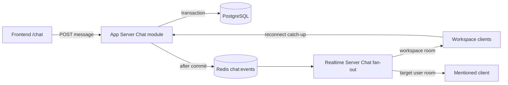

# Workspace Chat and Mentions Design

- Status: Approved in brainstorming; implementation review gate pending
- Issue: [#1186](https://github.com/Developer-EJ/PILO/issues/1186)
- Branch: `feat/1186-workspace-chat`
- Date: 2026-07-16
- Domain: Chat

## 1. Summary

PILO에 active Workspace 전용 `일반` 채팅방 하나를 추가한다. 사용자는 사이드바의
`채팅` 탭에서 전체 페이지 채팅을 열고, Workspace 멤버와 텍스트 메시지를 실시간으로
주고받으며, 과거 기록과 사용자별 unread 상태를 복원할 수 있다.

첫 버전은 Workspace 멤버 멘션도 지원한다. `@` 자동완성으로 멤버를 선택하면 메시지와
멘션 대상이 함께 저장되고, 대상 사용자에게만 실시간 멘션 알림이 전달된다. 기존 헤더
알림 드롭다운은 Workspace 초대와 active Workspace의 채팅 멘션을 함께 표시한다.

App Server와 PostgreSQL이 메시지와 읽음 상태의 source of truth다. Socket.IO는 저장이
끝난 이벤트를 Redis를 통해 fan-out하며, 실시간 이벤트가 누락되면 REST cursor 조회가
복구 경계가 된다.

## 2. Ownership and Review Gate

Chat은 현재 `AGENTS.md`의 Domain Ownership 표에 담당자가 지정되지 않은 신규 도메인이다.
Issue #1186의 구현 담당자를 지정하기 전에는 구현을 시작하지 않는다.

이 기능은 다음 소유·공통 영역을 변경하므로 구현 및 PR 전 확인이 필요하다.

| Area | Reason | Required confirmation |
| --- | --- | --- |
| Chat | 신규 API, UI, 실시간 이벤트의 1차 책임 | Chat 구현 담당자 지정 |
| Infra/Realtime | Socket handler 등록, Redis channel 구독과 room fan-out | 진호 |
| DB Schema | 신규 table, FK, index, RLS migration | 은재 |
| Frontend common | navigation registry, workspace shell, sidebar badge, header notification | 영향 도메인 담당자 |
| App Server common | `app.module.ts`에 Chat module 등록 | 영향 API 도메인 담당자 |

공통 영역 안에서 해결해야 하는 이유는 unread badge와 멘션 알림이 `/chat` 화면을 벗어나도
표시되어야 하고, Chat module과 Realtime handler가 서버 부팅 시 등록되어야 하기 때문이다.
Chat 비즈니스 로직은 공통 영역에 두지 않고 각 앱의 Chat 도메인 폴더가 소유한다.

## 3. Goals

- Workspace마다 하나의 `일반` 채팅방을 제공한다.
- 메시지를 영구 저장하고 cursor 기반으로 과거 기록을 조회한다.
- 저장 완료 메시지를 같은 Workspace 멤버에게 실시간 전달한다.
- 사용자별 unread 숫자와 `여기부터 읽지 않음` 구분선을 제공한다.
- 작성자가 메시지를 삭제하면 본문을 제거하고 tombstone을 남긴다.
- Workspace 멤버 `@` 자동완성과 대상 사용자 전용 멘션 알림을 제공한다.
- Socket 또는 Redis 장애가 발생해도 REST catch-up으로 최종 상태를 복구한다.
- Workspace 경계를 API, DB query, Socket room 모두에서 강제한다.

## 4. Non-goals

- 여러 채널, 채널 생성·수정·삭제
- 1:1 DM 또는 그룹 DM
- 파일·이미지 첨부
- 답글 thread, 이모지 reaction, 메시지 수정
- `@everyone`, 자기 자신 멘션, 관리자 강제 삭제
- typing indicator, delivery receipt, 사용자별 메시지 read receipt 표시
- push, email, 브라우저 notification
- 메시지 검색과 retention 만료 정책
- 범용 notification platform 재설계

## 5. User Experience

### 5.1 Navigation and page

- 공통 navigation registry에 `chat` feature를 추가한다.
- 사이드바의 `채팅` 항목은 `/chat`으로 이동한다.
- unread가 있으면 `채팅` 항목 오른쪽에 `99+` 상한의 숫자 badge를 표시한다.
- 채팅은 우측 overlay가 아니라 workspace shell 안의 전체 페이지로 렌더링한다.
- 모바일에서는 기존 sidebar가 접히고 채팅 본문과 composer가 전체 폭을 사용한다.

### 5.2 Message list

- 메시지는 `createdAt ASC, id ASC` 순서로 표시한다.
- 날짜가 바뀌면 날짜 separator를 표시한다.
- 메시지는 작성자 avatar, 표시 이름, 서버 생성 시각, 본문을 보여준다.
- 본문은 plain text로 렌더링하고 `http`와 `https` URL만 안전한 link로 변환한다.
- 삭제된 메시지는 작성자 정보와 위치를 유지하고 `삭제된 메시지입니다`로 표시한다.
- 첫 unread 메시지 앞에 `여기부터 읽지 않음 · N개` separator를 표시한다.
- 이전 기록은 목록 상단에서 cursor pagination으로 불러온다.

### 5.3 Composer

- trim 결과가 비어 있으면 전송할 수 없다.
- 최대 길이는 4,000자다.
- `Enter`는 전송, `Shift+Enter`는 줄바꿈이다.
- IME composition 중 `Enter`는 전송으로 처리하지 않는다.
- 전송 직후 client message를 `pending`으로 표시한다.
- 실패하면 본문을 유지한 채 `전송 실패 · 다시 시도`를 제공한다.
- 재시도는 최초 요청과 같은 `clientMessageId`를 사용한다.

### 5.4 Mentions

- composer에서 `@` 뒤에 문자열을 입력하면 active Workspace 멤버를 검색한다.
- 자동완성 결과는 avatar, 표시 이름, job title을 보여준다.
- keyboard 위·아래 이동, `Enter` 선택, `Escape` 닫기를 지원한다.
- 자기 자신은 자동완성 결과에서 제외한다.
- 한 메시지에서 멘션 알림 대상은 최대 20명의 고유 멤버다.
- 선택된 멤버는 본문에 `@표시 이름`으로 들어가고 `mentionedUserIds`에 user id가 저장된다.
- 메시지 표시 시 서버가 반환한 mention metadata와 일치하는 token을 강조한다.

### 5.5 Header notifications

- 기존 초대 알림과 active Workspace의 unread Chat mention을 한 드롭다운에 표시한다.
- header badge는 읽지 않은 초대 수와 읽지 않은 Chat mention 수의 합이다.
- Chat mention 항목은 actor, Workspace 이름, message excerpt, 생성 시각을 표시한다.
- mention을 클릭하면 `/chat?messageId={messageId}`로 이동하고 대상 메시지를 강조한다.
- 대상이 현재 page에 없으면 context API로 주변 메시지를 불러온다.
- 대상 메시지가 삭제됐거나 접근할 수 없으면 안전한 안내를 표시하고 알림을 읽음 처리한다.

## 6. Read Semantics

- Chat unread와 mention notification unread는 서로 다른 상태다.
- 자기 메시지와 삭제된 메시지는 Chat unread 숫자에서 제외한다.
- `workspace_chat_reads`가 없는 사용자는 membership `joined_at` 이후 메시지만 unread로 센다.
- 신규 멤버는 가입 전 기록을 조회할 수 있지만 가입 전 메시지는 unread가 아니다.
- `/chat` route가 active이고 document가 visible이며 목록 bottom sentinel이 보일 때만 최신
  message를 읽음 위치로 전송한다.
- read state update는 단조 증가한다. 오래된 tab의 요청이 last-read cursor를 뒤로 이동시키지
  않는다.
- mention notification은 사용자가 알림을 클릭하거나 `/chat`에서 해당 메시지를 실제로 볼 때
  읽음 처리한다.
- 삭제된 메시지에 연결된 mention은 unread count와 mention 목록에서 제외한다.

## 7. Architecture



### 7.1 Persistence boundary

- Frontend는 REST로 메시지를 생성·조회·삭제하고 read state를 갱신한다.
- App Server는 bearer session과 Workspace membership을 확인한 뒤 DB transaction을 수행한다.
- DB commit에 성공한 이벤트만 Redis `chat:events` channel에 publish한다.
- Redis publish 실패는 이미 저장된 메시지를 rollback하지 않는다.
- publish 실패와 Socket 누락은 reconnect, browser focus, `/chat` 진입 시 REST catch-up으로
  복구한다.
- transactional outbox는 첫 버전 범위에 포함하지 않는다.

### 7.2 Realtime boundary

- workspace layout에 있는 Chat runtime provider가 기존 authenticated Socket.IO 연결을
  재사용한다.
- active Workspace가 정해지면 Chat room에 join하고, Workspace 전환 시 이전 room을 leave한다.
- Realtime Server는 join마다 `workspace_members`를 확인한다.
- 일반 메시지와 삭제 이벤트는 Workspace Chat room으로 broadcast한다.
- mention 이벤트는 대상 사용자의 Workspace-scoped user room으로만 broadcast한다.
- Realtime Server는 메시지 본문을 쓰거나 수정하지 않는다.

## 8. Component Boundaries

### 8.1 Frontend

```text
apps/frontend/src/features/chat/
  page.tsx
  navigation.ts
  api/
  components/
  hooks/
  realtime/
  types/
  utils/
```

- `page.tsx`: Chat page composition과 route query 처리
- `api/`: summary, message, read state, mention API wrapper
- `components/`: message list, message item, composer, mention autocomplete
- `realtime/`: Socket event type, reducer, lifecycle adapter
- Chat runtime provider: active Workspace unread와 mention 상태를 소유
- 공통 sidebar/header는 Chat state를 표시하고 navigation action만 전달한다.

공통 영역 예상 변경:

- `apps/frontend/src/features/navigation.ts`
- `apps/frontend/src/components/main-shell.tsx`
- `apps/frontend/src/components/app-sidebar.tsx`
- `apps/frontend/src/components/header-notification-dropdown.tsx`
- `apps/frontend/src/app/(workspace)/layout.tsx`
- `apps/frontend/src/app/(workspace)/chat/page.tsx` route bridge

### 8.2 App Server

```text
apps/app-server/src/modules/chat/
  chat.module.ts
  chat.controller.ts
  chat.service.ts
  chat-publisher.service.ts
  dto/
  queries/
  types/
```

- controller: REST contract와 current user 전달
- service: Workspace access, validation, transaction, response mapping
- queries: Chat 전용 SQL과 cursor query
- publisher: commit 후 versioned Redis event publish
- `src/app.module.ts`: Chat module 등록만 수행

### 8.3 Realtime Server

```text
apps/realtime-server/src/chat/
  chat-access.service.ts
  chat-events.ts
  chat-fan-out.ts
  chat-payload.ts
  chat-room.service.ts
  chat-socket-handlers.ts
  chat-types.ts
```

- `socket/socket-server.ts`는 Chat handler와 Redis subscription 등록만 수행한다.
- payload parsing, room naming, access, fan-out은 `src/chat/`이 소유한다.

## 9. Database Design

Workspace 자체가 단일 `일반` 채팅방이므로 별도 room/channel table을 만들지 않는다.

### 9.1 `workspace_chat_messages`

| Column | Type | Rule |
| --- | --- | --- |
| `id` | UUID | primary key, generated |
| `workspace_id` | UUID | Workspace FK, cascade |
| `sender_user_id` | UUID nullable | User FK, account 삭제 시 null |
| `client_message_id` | TEXT | 1..128 characters |
| `content` | TEXT nullable | active row는 trim 1..4,000, deleted row는 null |
| `created_at` | TIMESTAMPTZ | server timestamp |
| `updated_at` | TIMESTAMPTZ | deletion update 포함 |
| `deleted_at` | TIMESTAMPTZ nullable | soft delete timestamp |
| `deleted_by_user_id` | UUID nullable | 작성자 user FK |

Constraints and indexes:

- `UNIQUE (id, workspace_id)` for same-Workspace composite references
- `UNIQUE (workspace_id, sender_user_id, client_message_id)` for idempotency
- `INDEX (workspace_id, created_at DESC, id DESC)` for history and unread
- active/deleted row shape check
- deleted timestamp order check

### 9.2 `workspace_chat_reads`

| Column | Type | Rule |
| --- | --- | --- |
| `workspace_id` | UUID | Workspace FK |
| `user_id` | UUID | membership user |
| `last_read_message_id` | UUID nullable | same-Workspace message |
| `last_read_at` | TIMESTAMPTZ nullable | server timestamp |
| `created_at` | TIMESTAMPTZ | created timestamp |
| `updated_at` | TIMESTAMPTZ | updated timestamp |

Constraints and indexes:

- `PRIMARY KEY (workspace_id, user_id)`
- composite FK to `workspace_members(workspace_id, user_id)` with membership delete cascade
- composite FK to message `(id, workspace_id)`
- read cursor update is application-level monotonic and transaction protected

### 9.3 `workspace_chat_mentions`

| Column | Type | Rule |
| --- | --- | --- |
| `id` | UUID | primary key |
| `workspace_id` | UUID | Workspace scope |
| `message_id` | UUID | same-Workspace message |
| `mentioned_user_id` | UUID | active Workspace member |
| `display_text` | TEXT | send 시점의 `@표시 이름` |
| `read_at` | TIMESTAMPTZ nullable | notification read timestamp |
| `created_at` | TIMESTAMPTZ | message transaction timestamp |

Constraints and indexes:

- `UNIQUE (message_id, mentioned_user_id)`
- composite FK to message and membership
- `INDEX (workspace_id, mentioned_user_id, read_at, created_at DESC)`
- mention 목록과 unread query는 message `deleted_at IS NULL`을 함께 확인한다.

### 9.4 Access policy

- 세 table 모두 baseline all-deny RLS를 활성화한다.
- 별도 client policy를 추가하지 않는다.
- App Server가 server credential로만 접근한다.
- Workspace 삭제는 Chat data를 cascade delete한다.
- membership 삭제는 해당 사용자의 read state와 mention notification을 제거한다.

## 10. REST Contract

Base path는 `/api/v1`이며 모든 Workspace endpoint는 bearer session과 path
`workspaceId` membership을 확인한다. Body의 Workspace/user identity는 신뢰하지 않는다.

| Method | Endpoint | Purpose |
| --- | --- | --- |
| `GET` | `/workspaces/{workspaceId}/chat/summary` | unread, mention unread, latest/read cursor |
| `GET` | `/workspaces/{workspaceId}/chat/messages` | cursor 기반 history |
| `GET` | `/workspaces/{workspaceId}/chat/messages/{messageId}/context` | mention target 주변 history |
| `POST` | `/workspaces/{workspaceId}/chat/messages` | message와 mentions 생성 |
| `DELETE` | `/workspaces/{workspaceId}/chat/messages/{messageId}` | author soft delete |
| `PUT` | `/workspaces/{workspaceId}/chat/read-state` | monotonic last-read update |
| `GET` | `/workspaces/{workspaceId}/chat/mentions` | current user mention 목록 |
| `PUT` | `/workspaces/{workspaceId}/chat/mentions/{mentionId}/read` | mention 읽음 처리 |

### 10.1 Message creation

```json
{
  "clientMessageId": "client-generated-id",
  "content": "@동현 확인 부탁해요",
  "mentionedUserIds": ["user_uuid"]
}
```

Rules:

- `mentionedUserIds`는 unique하게 normalize하고 최대 20명이다.
- server는 각 user가 active Workspace member이며 sender가 아닌지 확인한다.
- server는 current profile 규칙으로 `display_text`를 만들고 본문에 해당 token이 있는지 확인한다.
- message와 mentions는 한 transaction으로 생성한다.
- 같은 idempotency key와 같은 payload replay는 기존 message를 반환한다.
- 같은 key를 다른 content 또는 mention set으로 재사용하면 `409 IDEMPOTENCY_KEY_REUSED`다.
- 신규 생성은 `201`, idempotent replay는 `200`이다.

### 10.2 Message payload

```ts
type WorkspaceChatMessage = {
  id: string;
  workspaceId: string;
  clientMessageId: string;
  content: string | null;
  author: {
    id: string;
    displayName: string;
    avatarUrl: string | null;
  } | null;
  mentions: Array<{
    userId: string;
    displayText: string;
  }>;
  createdAt: string;
  deletedAt: string | null;
};
```

다른 사용자의 mention `readAt`은 message payload에 노출하지 않는다.

### 10.3 History and context

- `limit` 기본값은 50, 범위는 1..100이다.
- `before`는 server가 생성한 opaque cursor다.
- 한 page의 `items`는 UI가 바로 append할 수 있도록 chronological order로 반환한다.
- response는 `nextCursor`를 포함하며 더 오래된 기록이 없으면 null이다.
- context endpoint는 대상 message 앞뒤 최대 25개씩 반환한다.
- 다른 Workspace message id와 접근 불가 message id는 모두 `404 NOT_FOUND`다.

### 10.4 Delete

- current user가 원 작성자일 때만 삭제할 수 있다.
- content를 null로 만들고 `deleted_at`, `deleted_by_user_id`를 기록한다.
- 이미 삭제된 message delete는 현재 tombstone을 반환하는 idempotent success다.
- 삭제 이벤트 이후 mention query와 unread query는 해당 message를 제외한다.

### 10.5 Read state

```json
{
  "lastReadMessageId": "message_uuid"
}
```

- message는 path Workspace에 속해야 한다.
- 현재 cursor보다 오래된 message 요청은 state를 변경하지 않고 current state를 반환한다.
- server timestamp를 `last_read_at`에 기록한다.

### 10.6 Summary and mentions

Summary response fields:

- `latestMessageId`
- `lastReadMessageId`
- `unreadCount`
- `mentionUnreadCount`

Mention list는 current user의 active Workspace mention만 반환하고 다음을 포함한다.

- mention id와 read timestamp
- message id와 safe excerpt
- actor display profile
- Workspace id와 name
- created timestamp

## 11. Socket.IO Contract

Internal room names:

- Workspace Chat: `workspace:{workspaceId}:chat`
- Target user: `workspace:{workspaceId}:chat:user:{userId}`

| Direction | Event | Payload purpose |
| --- | --- | --- |
| client → server | `chat:join` | `{ workspaceId }` membership join |
| client → server | `chat:leave` | `{ workspaceId }` leave rooms |
| server → client | `chat:joined` | joined acknowledgement |
| server → client | `chat:message-created` | persisted full message |
| server → client | `chat:message-deleted` | message tombstone update |
| server → client | `chat:mention-created` | target-only mention notification |
| server → client | `chat:error` | safe socket error |

Redis channel은 `chat:events`다. Event envelope는 `version: 1`, `type`, `workspaceId`,
`occurredAt`, type별 payload를 포함한다. Realtime Server는 version과 payload를 검증한
뒤에만 emit한다.

Socket error code:

- `invalid_payload`
- `unauthenticated`
- `forbidden`
- `room_not_joined`
- `internal_error`

## 12. Failure Handling

| Failure | Behavior |
| --- | --- |
| POST timeout/failure | pending message를 failed로 표시하고 same id 재시도 제공 |
| Redis publish failure | DB message 유지, server log, focus/reconnect REST catch-up |
| Socket disconnect | 연결 상태 표시, REST write 유지, reconnect 후 summary/history catch-up |
| invalid mention member | draft 유지, member list refresh, safe validation message |
| membership removed | composer disable, Chat rooms leave, auth Workspace session refresh |
| stale read update | current server cursor 반환, cursor rollback 금지 |
| duplicate Socket event | reducer가 message id와 deletion state로 idempotent 처리 |
| deleted mention target | 안내 후 mention read, deleted message는 list/count 제외 |
| context target not found | 다른 Workspace 존재 여부를 노출하지 않는 `404`와 safe UI message |

## 13. Security and Privacy

- 모든 REST 요청은 bearer session과 Workspace membership을 확인한다.
- 모든 Socket join은 authenticated user의 Workspace membership을 확인한다.
- message, read, mention query는 항상 `workspace_id`를 조건에 포함한다.
- user id, sender id, created timestamp는 request body에서 받지 않는다.
- mention target room은 target user socket만 join한다.
- message content를 `dangerouslySetInnerHTML`로 렌더링하지 않는다.
- URL linkification은 `http`와 `https` scheme만 허용한다.
- error response와 log에는 bearer token 또는 secret을 포함하지 않는다.
- deleted content는 DB에서 null 처리하여 UI tombstone 뒤에 원문을 보존하지 않는다.
- 다른 Workspace resource id는 `404`로 처리해 존재 여부를 숨긴다.

## 14. Performance

- history는 offset이 아니라 opaque cursor를 사용한다.
- 기본 50개, 최대 100개 message만 반환한다.
- unread query는 Workspace/order index와 last-read cursor를 사용한다.
- mention dropdown은 cursor pagination을 사용하고 첫 page만 header에서 로드한다.
- Socket payload는 이미 저장된 response model만 전달하며 history snapshot을 broadcast하지 않는다.
- message list는 page 단위 state를 유지하고 필요하면 Frontend virtualization을 후속 최적화로
  추가한다. 첫 버전의 선행 요구사항은 아니다.

## 15. Testing Strategy

### 15.1 Database

- active/deleted message shape constraint
- same sender idempotency unique constraint
- same-Workspace composite FK
- membership 삭제 cascade
- history/unread/mention index 존재
- 세 table all-deny RLS

### 15.2 App Server

- Workspace access and cross-Workspace isolation
- message validation, cursor validation, safe `404`
- idempotent create replay와 conflicting reuse
- author-only delete와 repeated delete
- monotonic read cursor and new-member join cutoff
- mention membership, self mention, duplicate target, max target validation
- message와 mention transaction rollback
- Redis publish가 commit 이후 발생하고 publish failure가 DB result를 지우지 않음

### 15.3 Realtime Server

- authenticated join and forbidden join
- same Workspace broadcast와 other Workspace isolation
- target-only mention emit
- invalid Redis version/payload rejection
- join/leave/disconnect lifecycle
- duplicate/reordered event handling contract
- Redis adapter multi-instance fan-out

### 15.4 Frontend

- message reducer create/delete idempotency
- optimistic pending, failure, retry with same client id
- cursor prepend와 context target highlight
- bottom sentinel, visibility, route 기반 read update
- Workspace switch가 이전 state와 rooms를 정리함
- mention keyboard navigation과 한글 IME Enter 처리
- header invite + mention unread 합산과 navigation
- plain-text rendering과 safe URL linkification

### 15.5 Browser smoke

- 같은 Workspace의 두 사용자가 1초 이내에 message를 공유한다.
- reload 후 영구 기록이 복원된다.
- 다른 Workspace에서는 message, unread, mention이 노출되지 않는다.
- mention 대상에게만 header notification이 나타난다.
- 최신 message까지 확인해야 Chat unread가 해제된다.
- network retry가 duplicate message를 만들지 않는다.
- author delete가 모든 client에 tombstone으로 동기화된다.

## 16. Acceptance Criteria

- 사용자가 사이드바에서 `/chat`을 열고 active Workspace 대화를 볼 수 있다.
- text, emoji, plain URL을 포함한 message를 전송하고 reload 후 다시 볼 수 있다.
- 같은 Workspace online member가 저장 완료 message를 실시간으로 받는다.
- offline/reconnected client가 REST catch-up으로 누락 message를 복구한다.
- Chat unread badge와 separator가 server read state와 일치한다.
- author-only delete와 tombstone fan-out이 동작한다.
- `@` member autocomplete, mention validation, target-only notification이 동작한다.
- header notification에서 target message로 이동하고 읽음 상태가 여러 client에서 복원된다.
- API, DB, Socket 어느 경로에서도 cross-Workspace data가 노출되지 않는다.
- Frontend, App Server, Realtime Server의 format, lint, test, build가 통과한다.

## 17. Implementation Sequence

이 문서가 사용자 검토를 통과한 후 별도 implementation plan에서 세부 task와 commit 경계를
확정한다. 예상 순서는 다음과 같다.

1. Chat API/Socket canonical contract와 DB migration
2. App Server persistence와 read/mention API
3. Realtime Redis fan-out과 room lifecycle
4. Frontend Chat page, unread runtime, mention/header notification
5. cross-Workspace, reconnect, browser smoke와 full regression

이 순서는 구현 계획이 아니며, 승인된 설계의 dependency order만 기록한다.
